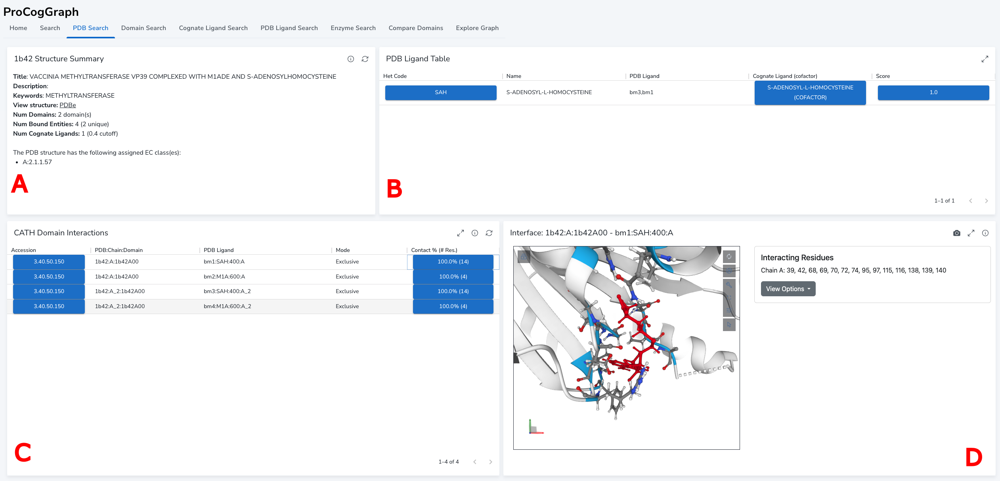

# ProCogGraph


A graph based cognate ligand-domain interaction database for exploring and mining domain-cognate ligand interactions.

## Table of Contents

- [Features](#features)
- [Quick Start](#quick-start)
- [Database Schema](#database-schema)
- [Dashboard](#dashboard)
- [Custom Queries](#custom-queries)
- [Database Information](#database-information)
  - [Cognate Ligands](#cognate-ligands)
  - [Domains](#domains)
- [License](#license)

## Features

ProCogGraph is a graph database which maps domains - cognate ligand interactions in enzyme structures in the PDBe. The database builds upon principles originally described by Bashton et al. in the PROCOGNATE database, and expands upon this database by expanding the domain databases used, including a wider range of cognate ligands, and updating the domain-ligand interaction mode and ligand similarity scoring methods.

To learn more, check out the ProCogGraph preprint on bioRxiv [here](LINKHEREWHENSUBMITTED).

## Quick Start

ProCogGraph is both a pipeline for analysis of structures and a database of cognate ligand-domain mappings. To get started, the easiest method, described below, is to run ProCogGraph in a Docker container - for installation instructions for the database on bare metal, and for running the Nextflow pipeline see the [installation](docs/installation.md) guide.

1. Download and install Docker from the [Docker website](https://www.docker.com/get-started)

2. Download the latest database flat files from Zenodo [here](https://ZENODOIDHERE) and clone the ProCogGraph repository:

    ``` bash
    git clone m-crown/ProCogGraph
    cd ProCogGraph
    ```

3. Run the setup script to download the latest flat files and create the necessary directories and Docker compose files if running on Linux:

    ``` bash
    ./setup_docker_linux.sh
    ```

    or for Windows:

    ``` bash
    ./setup_docker_windows.sh
    ```

    This script creates the necessary directories for setting up the database, downloads the latest flat files from Zenodo and produces two yaml files, one to build the database (run first time only) and one to run the database (run each time you want to start the database).

4. Run the build command:

    ``` bash
    docker compose -f docker-compose-build.yml up
    ```

5. Run the database:

    ``` bash
    docker compose -f docker-compose-run.yml up
    ```

    After running the Docker Compose script, two containers are started, one for the Neo4j database and one for the NeoDash dashboard. The database can be accessed by navigating to `http://localhost:7474` in a web browser or connecting to ProCogDash via [NeoDash Docker](http://localhost:5005/). The compose-run.yml file contains environment variables specifying memory allocation for the Neo4j database, which can be adjusted as necessary for your system. Currently, these are set to the recommended values for an 8GB memory system.

6. Access the dashboard. The ProCogDash dashboard is built using NeoDash, a Neo4j plugin, and is stored as a node within the database itself. The dashboard can be accessed by connecting to a running instance of the database in Docker at [NeoDash Docker](localhost:5005) or from the [NeoDash Website](http://neodash.graphapp.io/) website.

## Database Schema

The image below shows the schema of the ProCogGraph database, which is built using Neo4j. The database is built around the following key nodes:


- Entry: A PDB structure, which contains one or more protein chains and bound entities.

- Domain: An annotated sequence of a protein chain, which is classified into a domain database.

- Bound Entity: A small molecule or oligosaccharide which interacts with a domain.

- Cognate Ligand: Represents a ligand whcih is part of an enzyme reaction, and is mapped to one or more EC numbers.

## Dashboard

The dashboard contains five key visualisation modes: PDB, Cognate Ligand, PDB Ligand, Domain and EC. The homepage provides summary statistics for the number of structures and ligands represented in the current version of the graph, as well as the number of cognate ligand matches for the currently specified cutoff.

From the search page, global and visualisation specific settings can be specified:

| Parameter | Description | Options |
| ---- | ---- | ---- |
| Cutoff | The minimum similarity score for a cognate ligand match to be considered. | 0.0 - 1.0 |
| Domain Database | The domain database to be searched against. | CATH, Gene3D, Pfam, SCOP, SUPERFAMILY, SCOP2-SF , SCOP2-FA |
| Cognate Ligand Filter | The type of cognate ligand matches to be considered. | All , Best , Any (see below) |

When filtering cognate ligand matches in the database, users can select All, Best or Any. These parameters are described below:

- All: all bound entities for a PDB are displayed in the interaction table, regardless of whether they have a mapping to a cognate ligand.
- Any: all cognate ligand matches for a bound entity which are above the scoring threshold are presented.
- Best: only cognate ligands with the highest score for a given bound entity are shown.

It should be noted that even when set to “Best”, a bound entity may have matches to multiple cognate ligands with the same maximum score. ProCogGraph is designed to serve as an information source, and so does not make an effort to select a particular best match as the “Best” best match, instead leaving this up to the user.

### PDB Search Mode

To search for a structure, the PDB search box is used, and a PDB ID can be matched from any partial searches via a dropdown list. A clickable link is then presented next to the PDB search box, which takes you to the PDB visualisation mode (see image above). The PDB exploration page results are described in the table and image below:



| Section | Ref | Description |
| ---- | ---- | ---- |
| Summary Report | A | A summary of the PDB structure, including the number of chains, ligands, and domains present. |
| Domain Interaction Table | B | A table of interactions between domains and bound entities in the structure. |
| PDB Ligand Table | C | A table of bound entities present in the structure. |
| Domain Interaction Visualisation | D | An embedded iframe visualisation of the interacting residues between bound entities and domain residues in the structure,  using PDBe-Molstar. Residues from the currently focussed domain are highlighted in blue, and other domain residues highlighted in purple |
| PARITY Score Visualisation | E | PARITY score between cognate ligands and bound entities can also be viewed, showing both the MCS match and the atom matches, making up the PARITY score - visualised with RDKit JS. |

The iframe visualisations are loaded from GitHub pages (https://m-crown.github.io/ProCogGraph/) if using the online version of the graph or from an Nginx server running in the distributed Docker image if running locally.

For each domain listed in the PDB structure page, breakout links are accessible to a domain summary page (domains can also be searched for directly from the search page using the domain search box). This page includes a summary report of the number of ligands the domain is known to interact with, together with links to the external domain annotation. The report also summarises interactions for a domain at a “group” level which varies depending on the domain database being examined, for example, in the CATH/Gene3D/SCOP/SUPERFAMILY, the group level is Superfamily, and for Pfam, it is the family level. Summaries are presented on the following:
Group interactions table: lists all cognate ligands a group level are known to interact with in the database, together with the number of domains that interact with the ligand.
Domain Contexts: This query lists the contexts in which a domain interacts with a ligand i.e, the other domains involved in the interaction and their interaction modes.
Domain Cognate Ligand breakdowns: table lists the cognate ligands the specific domain searched for interacts with, and the percentage of the overall group the domain belongs to which also interact with the ligand. This is useful for identify if the cognate ligand a domain binds to reflects typical superfamily activity or is an outlier.

### Cognate/Bound Entity Search Mode

Cognate and PDB ligands can be viewed in detail through breakout from the PDB structure page view. Both pages contain a similar set of results tables including an RDKit.js visualisation of the ligand structure, a summary report detailing the cognate ligand database cross-references or the number of times a PDB ligand has been observed in the database, and the domain interactions that are observed for a ligand. Additionally, PDB ligands contain link tables to cognate ligand mappings. As with domains, PDB and cognate ligands can also be searched for directly from the search page, either by hetcode or name for PDBligands, or database ID (format DB:ID) or name for cognate ligand.

### EC Search Mode

When searching for an EC number, results are aggregated and links presented to relevent structures, cognate and PDB ligands, together with a summary of domains known to interact wit ligands In this reaction. In addition the reactions associated with the EC number within the RHEA database are visualised using RDKit-js, allowing for dynamic generation based on the reaction smiles strings associated with the EC nodes in the graph.
Every result presented in ProCogDash is generated using a Cypher query, which are contained within the neodash dashboard, and which is stored as a node within the database, allowing it to be versioned and distributed alongside the database itself. In addition to this, all queries are also made available within the repository as a single YAML file, where each query contains additional comments describing the underlying process.

## Custom Queries

Custom queries can be executed using the Cypher query language in the Neo4j browser (`http://localhost:7474` when using a local instance of the database). For example, to EXAMPLE QUERY HERE, the following query can be executed:

``` cypher
MATCH EXAMPLE QUERY HERE
RETURN EXAMPLE
```

## Database Information

### Cognate Ligands

#### Sources

Cognate ligands in ProCogGraph are aggregated from the following sources:

- KEGG
- ChEBI
- RHEA
- PubChem
- GlyTouCan

SMILES representations are obtained for each ligand, and each cognate ligand is mapped to one or more EC IDs. Cognate ligands are processed using the RDKit library in Python, with structures neutralised and re-canonicalised to reduce the number of duplicate structures. A total of XXX cognate ligands are currently represented in the database.

#### Similarity

ProCogGraph defines cognate ligand similarity using the PARITY method, which uses a permissive maximum common substructure and measures the number of matching atoms between ligands. The score ranges from 0-1 with 1 representing identical ligands and 0 representing no similarity.

EXAMPLE HERE?

A threshold value for defining a cognate ligand match is set at 0.40, based on the mean 95th percentile score for 5 sets of 2000 randomly paired ligands. Bound entity - cognate ligand pairs with a score below the threshold are not included in the database.

### Domains

#### Domain Annotation Sources

ProCogGraph uses domain annotations from SIFTS to describe domains. The following domain databases are included:

- CATH

- Gene3D

- Pfam

- SCOP

- SUPERFAMILY

- SCOP2 (Split into SCOP2-Superfamily and SCOP2-Family)

Interactions between domains and ligands are considered indepdently for each domain database included. The dashboard allows users to select a specific domain database to search against.

#### Interaction Modes

In ProCogGraph, domain ownership is represented in three different ways based on domain contact percentage (as determined using PDBe-Arpeggio), depending on the number of interaction domains (single, dual and multi-domain interactions):

| # Domains | Contact % | Type | Description |
| ---- | ---- | ---- | ---- |
| 1 | 100% | Exclusive | A single domain contacts the ligand. |
| 2+ | 90+% | Dominant | Two or more domains interact, and this domain dominates in terms of contact % |
| 2+ | <10% | Minor | Two or more domains interact, and this domain only plays a minor role in the interaction interface |
| 2+ | 10-90% Contacts | Major | Two + domains interact, and this domain is the only domain with more than 10% contacts (i.e. other domains are all minor) |
| 2+ | 50-90% Contacts | Major Partner | Two or more domains interact, and there is more than 1 non-minor domains. This domain contributes more than half of the total contacts measured for all domains. |
| 2+ | 10-50% Contacts | Partner | Two or more domains interact, and there is more than 1 non-minor domains. This domain has a non-minor contribution, but provides less than 50% of the total contacts measured for all domains. |

## License

ProCogGraph is licensed under the MIT License.
